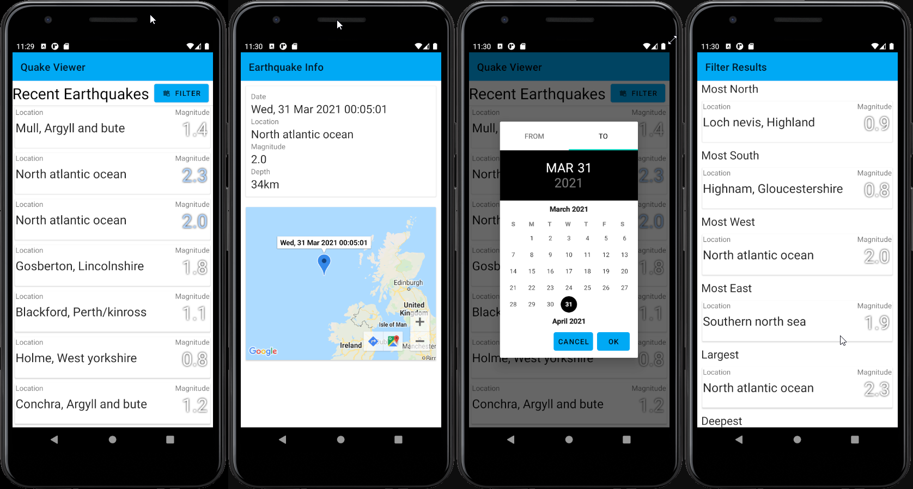

# mpd_coursework

An android app that reads in seismic activity from an RSS Feed specifically one provided by quakes.bgs.ac.yk (http://quakes.bgs.ac.uk/feeds/MhSeismology.xml)

## Features

- List Earthquakes
	- Location
	- Magnitude
- Colour coding that displays the earthquakes from strongest to weakest
- Select list items to show more details
	- Origin
	- Location
	- Magnitude
	- Depth
	- Google Maps View of the Epicenter
	 	- Allows zoom in/out
		- Colour coded marker
		- Origin as title
- Filter earthquakes using a date range
	- Shows the most Northerly/Southerly/Westerly/Easterly earthquake within the range
	- Show largest magnitude earthquake
	- Deepest and shallowest earthquake
	- Select the earthquakes to view more details
- Refresh information on swipe up
- Support for Portrait and Landscape modes

## Colour coding used

## Screenshots

